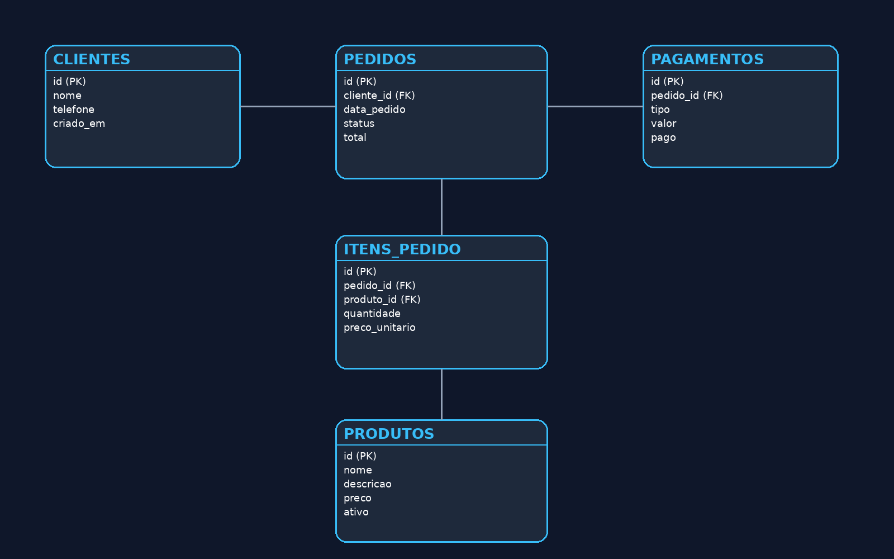

<p align="center">
  
</p>

<h1 align="center">🍔 Sistema de Gestão de Pedidos para Lanchonete</h1>

<p align="center">
  <b>Organização, controle e escalabilidade para pequenos negócios</b>
</p>

---

## 📌 Sobre o Projeto
Este projeto foi desenvolvido com o objetivo de solucionar problemas de organização em uma lanchonete que realizava o controle de pedidos manualmente.

Com o crescimento do negócio, surgiram dificuldades como:

- Perda de informações  
- Falta de controle dos pedidos  
- Desorganização no atendimento  

A solução proposta utiliza um banco de dados PostgreSQL para centralizar e estruturar todas as informações do sistema.

---

## 🎯 Objetivos do Sistema

- Organizar os pedidos  
- Centralizar os dados  
- Melhorar o controle do negócio  
- Permitir consultas rápidas  
- Preparar para crescimento futuro  

---

## 🧠 Problema Identificado

O uso de um caderno para registrar pedidos se torna inviável com o aumento da demanda, causando falhas operacionais e prejuízos.

---

## 🏗️ Estrutura do Banco de Dados

### 📋 Tabela: clientes
```sql
CREATE TABLE clientes (
    id SERIAL PRIMARY KEY,
    nome VARCHAR(100) NOT NULL,
    telefone VARCHAR(20),
    criado_em TIMESTAMP DEFAULT CURRENT_TIMESTAMP
);
```

### 🍔 Tabela: produtos

```sql
CREATE TABLE produtos (
    id SERIAL PRIMARY KEY,
    nome VARCHAR(100) NOT NULL,
    descricao TEXT,
    preco NUMERIC(10,2) NOT NULL,
    ativo BOOLEAN DEFAULT TRUE
);
```

### 🧾 Tabela: pedidos
```sql
CREATE TABLE pedidos (
    id SERIAL PRIMARY KEY,
    cliente_id INT REFERENCES clientes(id),
    data_pedido TIMESTAMP DEFAULT CURRENT_TIMESTAMP,
    status VARCHAR(30) DEFAULT 'PENDENTE',
    total NUMERIC(10,2)
);
```

### 🛒 Tabela: itens_pedido
```sql
CREATE TABLE itens_pedido (
    id SERIAL PRIMARY KEY,
    pedido_id INT REFERENCES pedidos(id) ON DELETE CASCADE,
    produto_id INT REFERENCES produtos(id),
    quantidade INT NOT NULL,
    preco_unitario NUMERIC(10,2) NOT NULL
);
```
### 💳 Tabela: pagamentos
```sql
CREATE TABLE pagamentos (
    id SERIAL PRIMARY KEY,
    pedido_id INT REFERENCES pedidos(id),
    tipo VARCHAR(30),
    valor NUMERIC(10,2),
    pago BOOLEAN DEFAULT FALSE
);
```
### 🧪 Dados de Teste
```sql
INSERT INTO clientes (nome, telefone) VALUES
('João Silva', '81999999999'),
('Maria Souza', '81988888888');
```
```sql
INSERT INTO produtos (nome, descricao, preco) VALUES
('Hambúrguer', 'Hambúrguer artesanal', 15.00),
('Refrigerante', 'Lata 350ml', 5.00),
('Batata Frita', 'Porção média', 10.00);
```
### 🧾 Simulação de Pedido
```sql
INSERT INTO pedidos (cliente_id, total)
VALUES (1, 30.00);
```
```sql
INSERT INTO itens_pedido (pedido_id, produto_id, quantidade, preco_unitario)
VALUES
(1, 1, 1, 15.00),
(1, 2, 1, 5.00),
(1, 3, 1, 10.00);
```
```sql
INSERT INTO pagamentos (pedido_id, tipo, valor, pago)
VALUES (1, 'PIX', 30.00, TRUE);
```
### 🔎 Consultas SQL
-- Listar pedidos com cliente
```sql
SELECT p.id, c.nome, p.data_pedido, p.status, p.total
FROM pedidos p
JOIN clientes c ON p.cliente_id = c.id;
```
-- Calcular total por pedido
```sql
SELECT 
    p.id,
    SUM(i.quantidade * i.preco_unitario) AS total
FROM pedidos p
JOIN itens_pedido i ON p.id = i.pedido_id
GROUP BY p.id;
```

### 🖼️ Diagrama do Banco
<p align="center">  </p>

### 🚀 Tecnologias Utilizadas

```
PostgreSQL
SQL
Modelagem Relacional
```

### 👨‍💻 Autor
Adriano Amorim Agra
